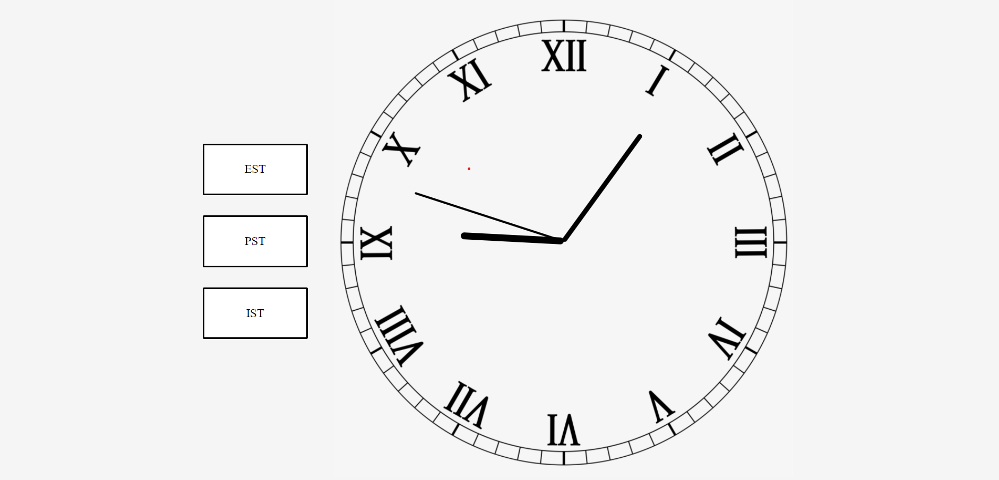

# Interactive Web Analog Clock

This project is an interactive web analog clock created using HTML, CSS, and JavaScript. It allows users to view the current time in different time zones by clicking on the respective buttons. (keeping in mind the daylight saving times)

## Features

- **Analog Clock**: Displays the current time with hour, minute, and second hands.
- **Time Zones**: Allows users to switch between different time zones (EST, PST, IST) by clicking on the buttons.

## Usage

1. **Clone the Repository**:
    ```bash
    git clone https://github.com/lizarora/analog-clock.git
    cd analog-clock
    ```

2. **Open `index.html`**:
    Open the `index.html` file in your web browser to view the analog clock.

3. **Select a Time Zone**:
    Click on one of the time zone buttons (EST, PST, IST) to update the clock to the selected time zone.

## Code Explanation

- **HTML**: The structure of the clock and buttons for time zones are created in the `index.html` file.
- **CSS**: The `style.css` file contains the styling for the clock and time zone buttons.
- **JavaScript**: The `index.js` file contains the logic for updating the clock's time and handling the time zone changes.

## HTML Structure

- **Clock**: The clock is composed of `div` elements for the hour, minute, and second hands.
- **Time Zone Buttons**: There are three buttons for selecting different time zones.

## CSS Styling

- **Clock Hands**: The hands of the clock are styled using absolute positioning and rotation.
- **Time Zone Buttons**: The buttons are styled to be visually distinct and interactive.

## JavaScript Logic

- **Current Time Calculation**: The `currentTime` function calculates the current time, adjusts it for the selected time zone, and updates the rotation of the clock hands accordingly.
- **Event Listeners**: Event listeners are added to the time zone buttons to update the selected time zone and refresh the clock.

## Time Zones

- **EST**: Eastern Standard Time (UTC-5)
- **PST**: Pacific Standard Time (UTC-8)
- **IST**: Indian Standard Time (UTC+5:30)

## Demo




